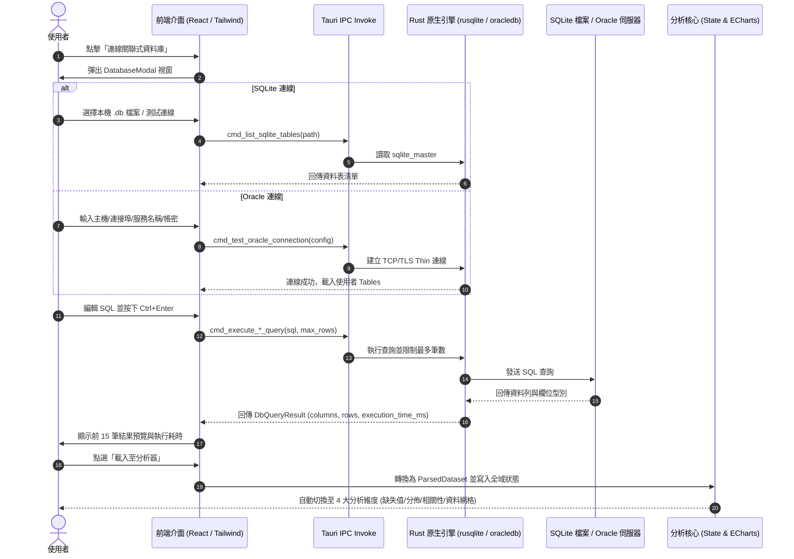

# NoneWeb Data Analyzer - 資料庫連線與查詢分析功能說明書 (Database Integration Guide)

> **版本**：v1.3.0  
> **模組名稱**：關聯式資料庫連線與 SQL 數據探勘模組 (Relational DB & SQL Ingestion Engine)  
> **發布日期**：2026 年 9 月  
> **支援資料庫**：SQLite (`.db`, `.sqlite`, `.sqlite3`)、Oracle Database (11g / 12c / 19c / 21c / 23ai)

---

## 1. 功能概述 (Overview)

為了擴展 **NoneWeb Data Analyzer** 從靜態檔案（CSV, TSV, Excel）到企業級與嵌入式資料來源的支援，本次更新新增了完整的 **關聯式資料庫連線與 SQL 查詢功能**。

使用者可直接透過原生介面：
1. 連線本機 **SQLite** 資料庫檔案，或連線遠端 **Oracle Database**。
2. 自動瀏覽資料表清單（Schema Tables），一鍵帶出查詢範本。
3. 撰寫自訂 SQL 查詢語句，具備提取上限防呆（預設 10,000 筆）、`Ctrl+Enter` 快捷鍵執行。
4. 於介面中即時檢視查詢耗時與前 15 筆結果預覽。
5. 一鍵 **「載入至分析器」**，自動將 SQL 查詢結果轉換為標準資料集 (`ParsedDataset`)，無縫銜接既有的缺失值分析、數據分布、相關性矩陣、原始資料網格與 HTML 診斷報告匯出。

---

## 2. 核心設計原則 (Core Architecture Principles)

### 2.1 100% 綠色版免安裝 (Zero-Client & Portable)
- **SQLite 靜態內嵌**：在 Rust 原生層採用 `rusqlite`（`features = ["bundled"]`），將 SQLite 引擎直接靜態編譯進二進位執行檔，使用者本機無需安裝任何 SQLite 軟體或環境。
- **Oracle 純 Rust 薄驅動 (Pure-Rust Thin Driver)**：採用官方純 Rust `oracledb` 驅動，透過純 Rust 網路協定與 TLS 直接連線遠端 Oracle 監聽器（Listener），**完全不需要安裝 Oracle Instant Client**，亦無需手動設定 `PATH` 或配置 `OCI.DLL`。

### 2.2 資料提取安全防呆 (Query Safeguards)
- **筆數上限保護機制**：提供 `LIMIT / ROWNUM` 等級的提取上限（1,000 / 5,000 / 10,000 / 50,000 / 100,000），避免使用者無意間撈取數百萬筆巨量資料造成前端記憶體耗盡。
- **唯讀/查詢保護建議**：前端介面提供提示與安全保護，專注於 `SELECT` 與報表資料撈取。

### 2.3 零配置快速回溯 (Zero-Friction Reusability)
- **多組連線設定檔管理**：支援將 Oracle 連線資訊（主機、Port、Service/SID、帳號）保存於本機 LocalStorage，支援快速切換與刪除。
- **歷史查詢回溯**：自動記錄過去執行的 SQL 語句、執行時間與筆數，點擊歷史記錄即可重新載入編輯器。

---

## 3. 系統架構與呼叫流程 (Architecture & Data Flow)



---

## 4. 程式碼異動與新增檔案清單 (Modified Files)

### 4.1 後端原生層 (Rust / Tauri)
| 檔案路徑 | 類型 | 說明 |
| :--- | :---: | :--- |
| [`src-tauri/Cargo.toml`](src-tauri/Cargo.toml) | 修改 | 引入 `rusqlite = { version = "0.32", features = ["bundled"] }` 與 `oracledb = "26.0.0-beta.2"` |
| [`src-tauri/src/db/mod.rs`](src-tauri/src/db/mod.rs) | 新增 | 定義資料庫模組入口，導出 SQLite 與 Oracle 子模組 |
| [`src-tauri/src/db/sqlite.rs`](src-tauri/src/db/sqlite.rs) | 新增 | 實作原生檔案對話框選取、連線測試、讀取資料表 Schema、SQL 查詢執行與單元測試 |
| [`src-tauri/src/db/oracle.rs`](src-tauri/src/db/oracle.rs) | 新增 | 實作 Oracle 薄型連線建立、連線測試、讀取 `USER_TABLES` 與 SQL 查詢提取 |
| [`src-tauri/src/lib.rs`](src-tauri/src/lib.rs) | 修改 | 註冊 `cmd_pick_sqlite_file`、`cmd_test_sqlite_connection`、`cmd_list_sqlite_tables`、`cmd_execute_sqlite_query`、`cmd_test_oracle_connection`、`cmd_list_oracle_tables`、`cmd_execute_oracle_query` 七大 Tauri 指令 |

### 4.2 前端應用層 (TypeScript / React)
| 檔案路徑 | 類型 | 說明 |
| :--- | :---: | :--- |
| [`src/types/database.ts`](src/types/database.ts) | 新增 | 定義 `OracleConfig`、`SqliteConfig`、`DbQueryResult`、`QueryHistoryItem` 介面 |
| [`src/utils/dbStorage.ts`](src/utils/dbStorage.ts) | 新增 | 實作 Oracle 連線設定檔管理、最近 SQLite 路徑與 SQL 歷史紀錄之 LocalStorage 讀寫 |
| [`src/components/DatabaseModal/DatabaseModal.tsx`](src/components/DatabaseModal/DatabaseModal.tsx) | 新增 | 資料庫連線彈窗主組件，包含分頁切換、連線設定表單、資料表抽屜、SQL 編輯器、結果預覽與狀態反饋 |
| [`src/components/FileUploader.tsx`](src/components/FileUploader.tsx) | 修改 | 於檔案上傳首頁增設「連線關聯式資料庫」指引卡片與頂部快捷操作按鈕 |
| [`src/App.tsx`](src/App.tsx) | 修改 | 於頂部 Navbar 新增「資料庫連線」常駐按鈕，實作 `handleDbDataLoaded` 將查詢資料封裝並注入為分析器資料集 |
| [`.gitignore`](.gitignore) | 修改 | 增加 `*.db`、`*.sqlite`、`*.sqlite3` 忽略規則，避免測試資料庫提交至 Git |

---

## 5. 操作手冊 (User Manual)

### 5.1 使用 SQLite 進行分析
1. 啟動軟體後，在首頁點擊 **「連線關聯式資料庫」**（或點擊頂部導航列的「資料庫連線」）。
2. 在彈窗頂部切換至 **「SQLite」** 標籤頁。
3. 點擊「瀏覽...」透過系統檔案對話框選擇您的本機資料庫檔案（例如專案隨附的 `demo_database.db`）。
4. 點擊 **「測試連線」**，左側「資料表清單」將即時列出所有資料表。
5. 點擊資料表名稱（如 `sales_records`），編輯器將自動填入：
   ```sql
   SELECT * FROM sales_records LIMIT 10000;
   ```
6. 根據需求修改條件（支援所有標準 SQLite SQL 語法），按下 **`Ctrl + Enter`**（或點擊「執行查詢」）。
7. 確認下方預覽表格之欄位型別與資料正確無誤後，點選右下角 **「載入至分析器」**。

### 5.2 使用 Oracle Database 進行分析
1. 在彈窗頂部切換至 **「Oracle Database」** 標籤頁。
2. 填寫連線參數：
   - **連線類型**：
     - **標準連線**：填寫「主機名稱/IP」（例如 `10.20.30.40`）、「Port」（預設 `1521`）、「服務名稱 / SID」（例如 `ORCLPDB1`）。
     - **Easy Connect**：直接填寫連線字串（例如 `sales-server:1521/XEPDB1`）。
   - **驗證資訊**：輸入使用者名稱（User）與密碼（Password）。
3. 點擊 **「測試連線」**：系統將直接與遠端 Oracle 進行交握。
4. （可選）點擊 **「儲存此連線設定」**，日後可由「已儲存的連線」下拉選單快速載入。
5. 連線成功後，左側將展開該帳號擁有的資料表（由 `USER_TABLES` 查詢），點擊即可自動生成查詢語句：
   ```sql
   SELECT * FROM EMPLOYEES WHERE ROWNUM <= 10000;
   ```
6. 按下 **`Ctrl + Enter`** 執行，下方即時預覽前 15 筆記錄與欄位型別。
7. 點擊 **「載入至分析器」**，軟體將自動為資料集命名（例如 `Oracle: EMPLOYEES (10000 rows)`），並立即啟用 4 大數據分析維度。

---

## 6. 注意事項與常見問答 (FAQ)

### Q1: 連線 Oracle 是否需要事先在 Windows 安裝 Oracle Client 或配置環境變數？
**完全不需要**。本軟體內建純 Rust 網路驅動，直接編譯入二進位執行檔，無需 Oracle Instant Client、無需 OCI.dll、亦無需配置 `ORACLE_HOME` 或 `TNS_ADMIN`。

### Q2: 查詢筆數是否有限制？
有。為確保桌面應用程式的流暢度與渲染效能，介面提供「最大筆數」下拉選單（預設 10,000 筆，最高支援 100,000 筆）。若資料庫包含百萬筆資料，建議於 SQL 中加上適當的篩選條件 (`WHERE`) 或聚合分析 (`GROUP BY`)。

### Q3: 查詢歷史會保存在哪裡？
所有連線名稱、連線參數與歷史 SQL 語句皆儲存於瀏覽器層的本機安全儲存區（LocalStorage），不會外傳，重新啟動軟體依然完整保留。
