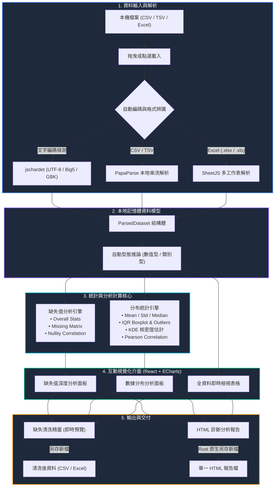
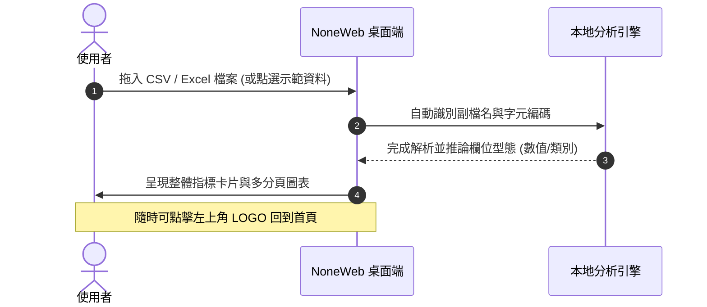

# NoneWeb Data Analyzer (免安裝綠色版資料缺失值與分布分析器)

> **極致輕量、100% 本地離線運作、零雲端依賴的現代化資料診斷與探索性分析 (EDA) 桌面工具**

---

## 📖 專案簡介 (Overview)

**NoneWeb Data Analyzer** 是一款專為資料分析師、機器學習工程師、研究人員及業務人員設計的單一檔案免安裝（Portable）桌面應用程式。

許多傳統資料分析工具需要繁複的 Python 環境配置（如 Jupyter Notebook、Pandas、Seaborn、Missingno 等），或者將機密資料上傳至第三方雲端平台處理。**NoneWeb Data Analyzer** 實現了「下載即用、單一 .exe、全本地計算」，完全不需連網、無任何 API KEY 配額消耗，保障企業與個人資料 100% 隱私安全。

---

## ✨ 核心特色 (Key Features)

- 🚀 **免安裝單一執行檔 (Portable .exe)**：體積僅約 9MB，不需安裝 Python、Node.js 或任何執行階段環境，雙擊即可使用。
- 🔒 **100% 純本地離線計算 (Zero-Cloud / No API Key)**：所有解析、統計矩陣、核密度估計（KDE）與圖表渲染皆在本地記憶體中完成，拔掉網路線依然能全功能運作。
- 📂 **多元格式與編碼支援**：
  - 支援格式：`CSV`、`TSV`、`Excel (.xlsx, .xls)`。
  - 多工作表：支援 Excel 內多個 Sheet 即時切換分析。
  - 編碼容錯：內建字元編碼偵測，相容 `UTF-8`、繁體中文 `Big5`、簡體中文 `GBK` 等，徹底告別中文亂碼。
- 🧩 **缺失值深度診斷 (Missing Value Analysis)**：
  - **缺失值矩陣 (Missingno Matrix)**：以黑白像素條紋直觀呈現資料集中缺失值的分佈型態與資料缺漏區塊。
  - **缺失率排序長條圖**：各欄位缺失數量、百分比一覽無遺。
  - **缺失共現相關係數熱力圖 (Nullity Correlation)**：自動計算各欄位缺失值之間的關聯度，協助判斷是「完全隨機缺失 (MCAR)」或「相依缺失 (MAR)」。
- 📊 **數值與類別分布統計 (Distribution Analysis)**：
  - **數值型**：動態直方圖 + 高斯核密度曲線 (KDE, 支援 Bin 分箱滑桿)、箱形圖 (Boxplot, IQR 異常值偵測)、五數摘要、累積分布函數 (CDF)。
  - **類別型**：頻率分布長條圖、占比圓餅圖、前 N 名類別分布、眾數統計。
  - **變量相關性**：全特徵皮爾森相關矩陣熱力圖 (Pearson Correlation) 與雙變量互動散佈圖 (Scatter Plot)。
- 🧹 **互動清洗與插值精靈 (Cleaner & Imputer)**：
  - 支援缺失閾值剔除欄位、剔除含缺資料列。
  - 支援數值型填補（平均值、中位數、補零）與類別型填補（眾數、自訂文字常數）。
  - 清洗結果即時預覽，並支援匯出處理後的 CSV / Excel。
- 📑 **一鍵匯出 HTML 診斷報告**：產生格式精美、排版專業的單一 HTML 體檢報告，方便直接列印或交付報告。

---

## 🔄 系統架構與資料處理流程 (System Architecture)



---

## 🖥️ 使用者操作手冊 (User Manual)

### 1. 快速開始與載入檔案
1. 雙擊執行根目錄下的 **`NoneWeb-Data-Analyzer.exe`**。
2. **載入檔案**：
   - **拖曳上傳**：直接將桌面或資料夾中的 CSV、TSV 或 Excel 檔案拖入首頁虛線方框。
   - **手動選擇**：點擊「選擇檔案」按鈕挑選本機檔案。
   - **示範體驗**：若手邊暫無測試資料，可點擊 **「載入示範資料 (醫療健檢數據)」**，系統將自動載入具備數值、類別與各級缺失值的範例資料集。
3. **更換檔案 / 回到首頁**：
   - 隨時點選畫面左上角的 **「NoneWeb Data Analyzer / N LOGO」** 或右上角的 **「回到首頁」** 按鈕，即可清空當前資料並返回上傳介面。



---

### 2. 工作表 (Sheets) 與字元編碼切換
- **Excel 多工作表**：若匯入的 Excel 包含多個工作表，上方工具列會顯示「工作表切換」下拉選單，點選即可秒級切換分析不同工作表。
- **中文編碼手動覆寫**：若遇到罕見的舊式編碼檔案，可於頂部工具列切換 `UTF-8`、`Big5` 等編碼，系統將立即重新解碼。

---

### 3. 功能分頁操作詳解

#### 📌 分頁一：缺失值深度分析 (Missing Values)
- **整體概況指標**：即時顯示總列數、欄位數、有效值筆數、整體缺失率、完整列比例（無任何缺失的列數）及有缺值的欄位數量。
- **缺失值矩陣圖 (Missingno Canvas)**：
  - 深藍色代表有效數據，白色代表缺失值。
  - 若資料有系統性缺失（如特定時間區段全部無值，或某欄位有值時另一欄位必無值），在矩陣中會呈現明顯的水平橫紋或色塊對比。
- **欄位缺失率長條圖**：由高至低排列所有含缺失欄位，並標示缺失筆數與百分比。
- **缺失共現相關矩陣**：計算欄位間缺失狀況的相關係數（1 代表同時缺失，-1 代表互斥缺失）。

---

#### 📌 分頁二：數據分布分析 (Distribution)
- **左側欄位切換清單**：
  - 欄位會以標籤區分 **`[數值]`** 或 **`[類別]`**，點選即可切換右側圖表。
- **數值型欄位視覺化**：
  - **直方圖與 KDE 曲線**：可透過上方的「分箱數量 (Bins)」滑桿（5 ~ 60）即時調整分組粒度，觀察分布型態（常態分布、偏態分布、雙峰分布等）。
  - **五數綜合統計**：顯示平均值 (Mean)、標準差 (Std)、最小值 (Min)、第一四分位數 (Q1)、中位數 (Median)、第三四分位數 (Q3)、最大值 (Max)、偏態係數 (Skewness)。
  - **IQR 箱形圖與離群值清單**：以 Tukey 箱形圖檢視資料中位數與四分位距，並標示出所有超出 $1.5 \times \text{IQR}$ 的極端離群值筆數。
  - **累積分布函數 (CDF)**：快速了解特定數值以下佔全體資料的累積百分比。
- **類別型欄位視覺化**：
  - **頻率直方圖與占比圓餅圖**：直觀掌握各類別占比。
  - **類別摘要**：統計唯一類別數 (Unique Count)、眾數 (Mode) 以及前 5 名最頻繁出現的類別比例。
- **變量相關性熱力圖 (Correlation Matrix)**：
  - 整合所有數值型欄位的皮爾森相關係數矩陣。
  - 提供互動式雙變量「X 軸 vs Y 軸散佈圖 (Scatter Plot)」，支援直觀驗證變量間的線性或非線性關聯。

---

#### 📌 分頁三：互動資料檢視表格 (Data Grid)
- **真實數據預覽**：提供分頁瀏覽（每頁 15 筆），便於抽樣核對資料內容。
- **缺失值顯著高亮**：儲存格中的缺失值會特別以紅色 `<NULL>` 徽章高亮標示。
- **快速搜尋過濾**：支援關鍵字即時檢索過濾資料列。

---

### 4. 缺失清洗與補值精靈 (Cleaner & Imputer)
點擊導航列右側的 **「缺失清洗與補值」** 按鈕：
1. **設定處理規則**：
   - **剔除高缺失欄位**：可滑動調整缺失比例門檻（例如剔除缺失率超過 50% 的欄位）。
   - **刪除含缺資料列**：一鍵剔除含有任一缺失值的整筆記錄。
   - **數值型插值填補**：可選擇「填補平均值 (Mean)」、「填補中位數 (Median)」或「填補為 0」。
   - **類別型插值填補**：可選擇「填補為眾數 (Mode)」或「填補自訂文字（預設為『缺失值』）」。
2. **即時預覽比較**：畫面中央會即時比較處理前與處理後的維度差異（被剔除的欄數與列數）。
3. **套用或匯出**：
   - 點擊 **「套用至主畫面」**：以清洗後的乾淨資料即時替換當前分析儀表板。
   - 點擊 **「匯出 CSV」** 或 **「匯出 Excel」**：觸發 Windows 原生另存新檔對話框，將清洗後的乾淨資料儲存至指定磁碟位置。

---

### 5. 匯出 HTML 診斷分析報告
1. 點選導航列右上角的 **「匯出診斷報告 (HTML)」** 按鈕。
2. 系統將開啟 Windows 原生「另存新檔」視窗，預設檔名為 `[原檔名]_診斷分析報告.html`。
3. 儲存後將提示儲存路徑，直接雙擊該 HTML 檔案即可在任何瀏覽器中檢視：
   - 檔案維度與編碼中繼資訊。
   - 整體缺失率與指標卡片。
   - 完整欄位缺失清單與進度長條。
   - 數值型變量五數統計、偏態係數與異常值筆數表。
   - 類別型變量眾數與高頻分布表。
   - 內嵌列印樣式（支援 `Ctrl + P` 直接轉存高品質 PDF 報表）。

---

## 🛠️ 開發與建置說明 (Development & Build)

### 系統先決條件
- **Node.js**：v18.0.0 以上
- **Rust & Cargo**：1.77.2 以上 (支援 MSVC toolchain)
- **Windows 10 / 11** (內建 WebView2 Runtime)

### 安裝依賴
```bash
# 安裝前端相依套件
npm install
```

### 本地開發預覽模式
```bash
# 啟動 Vite 前端熱更新預覽
npm run dev
```

### 一鍵自動編譯（推薦）
直接雙擊執行專案根目錄下的 **`build.bat`** 批次檔，腳本將自動：
1. 檢查 Node.js 與 Rust 編譯環境
2. 關閉執行中的舊版程式避免檔案衝突
3. 編譯前端資源 (`npm run build`)
4. 編譯 Rust 獨立離線二進位檔 (`cargo build --release`)
5. 自動將最新執行檔複製至專案根目錄 `NoneWeb-Data-Analyzer.exe`

### 手動編譯指令
```bash
# 1. 編譯前端靜態資產 (輸出至 dist 目錄)
npm run build

# 2. 編譯 Rust 後端並打包所有前端靜態檔案至二進位檔中
cd src-tauri
cargo build --release
```
編譯完成之獨立執行檔位於：
`src-tauri/target/release/NoneWeb-Data-Analyzer.exe`（可複製至根目錄直接點選使用）

---

## 📋 專案目錄結構 (Project Structure)

```
NoneWeb-Data-Analyzer/
├── NoneWeb-Data-Analyzer.exe  # 免安裝獨立綠色版執行檔 (~9MB)
├── build.bat                  # 一鍵自動化編譯打包批次檔

├── src/                       # React 19 前端原始碼
│   ├── components/            # UI 視圖組件 (矩陣、圖表、分析器、表格)
│   ├── types/                 # TypeScript 資料模型定義
│   ├── utils/                 # 本地分析演算法 (統計、缺失分析、編碼辨識、報告匯出)
│   ├── App.tsx                # 主應用程式佈局與狀態
│   └── main.tsx               # 前端進入點
├── src-tauri/                 # Tauri v2 桌面端與 Rust 後端
│   ├── src/
│   │   ├── lib.rs             # Tauri 原生命令註冊 (含 Windows 原生另存新檔對話框)
│   │   └── main.rs            # 應用程式啟動進入點
│   ├── Cargo.toml             # Rust 相依庫 (tauri, rfd, base64 等)
│   └── tauri.conf.json        # 視窗外觀與離線靜態打包設定
├── vite.config.ts             # Vite + Tailwind CSS 設定
├── package.json               # Node 依賴配置
└── README.md                  # 使用者操作手冊
```

---

## 📄 授權協議 (License)

本專案採用 **MIT License** 授權開源，歡迎自由使用、研究或修改。

